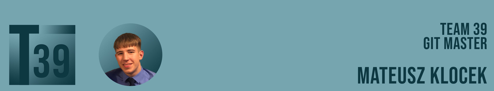

# Mateusz Klocek

## Personal Details
- **Name**: Mateusz Klocek
- **Role**: Computer Science Student
- **Student Code**: 20481196

## Contact Information

- **Email**: [mateusz.k3m@gmail.com](mailto:mateusz.k3m@gmail.com)
- **LinkedIn**: [Mateusz Klocek](www.linkedin.com/in/mateuszklocek)
- **Phone**: +44 (0) 7759375351

## EDUCATION
**University Of Nottingham | Sep 2022 – Jun 2025**  
_Bachelor of Computer Science_  
Nottingham, UK  
- Predicted 1st – Average module grade: 82%
- Committee member of the University Brazilian Jiu-Jitsu club as Media Secretary

**William Farr | Sep 2015 – Jun 2022**  
- A-Levels : Mathematics (A), Computer Science (A), Physics (A)  
Lincoln, UK  
- Extended Project Qualification : “Computer Assembly Guide” (A*)
- GCSEs: Ten GCSEs graded 5-7 - incl : Mathematics (7), English Language (6), Polish (A)

## WORK EXPERIENCE
**Lincolnshire Co-operative - Pharmacy Warehouse Assistant - Lincoln, UK | Dec 2021 – Aug 2022**  
- Supported operations of the community Pharmacy and Distributions warehouse averaging 22,000 items processed per month. Gained hands-on experience in optimising workflow efficiency and inventory management.
- Leveraged technology solutions to enhance inventory tracking and streamline processes.

**Carpenters Arms - Culinary Apprentice - Lincoln, UK | May 2020 – Dec 2021**  
- Excelled within a dynamic culinary setting. Honed my ability to perform successfully under high pressure and adapt to changing circumstances.

**Golden Hill - Customer Services and Cashier - Lincoln, UK | Jun 2019 – Mar 2020**  
- Acquired a unique skill set that surpasses traditional cashiering duties. Emphasis on providing exceptional service to an average of 60 customers a day.

## EXTRACURRICULARS
**University of Nottingham Brazilian Jiu-Jitsu Club - Media Secretary – Committee Role | Sep 2023 – Present**  
- Elected as the club’s Media Secretary. Helped recruit new members and supported the record induction of 70 new paying members to the club.

**Young Professionals - TechTheFuture Virtual Work Experience | July 2021**  
- Engaged with top technology professionals and FTSE 100 tech companies. Developed my skills in remote collaboration and effective communication.

## SKILLS & INTERESTS
- **Languages**: Fluent in both English and Polish  
- **Coding**: Python|Java|C|JavaScript|CSS|HTML|PHP|SQLite|MySQL|Flask|Haskel|ARM|VS Code|IntelliJ IDEA|Git|Linux  
- **Media**: Adobe Suite (Premiere Pro, Photoshop, Media Encoder)|Instagram Professional Account|YouTube Creator Studio  
- **Physical Wellness**: Aspiring hybrid athlete, increasing strength and endurance.  
- **Personal Interests**: Hiking, Skiing, Surfing, Gastronomy, Physics  
